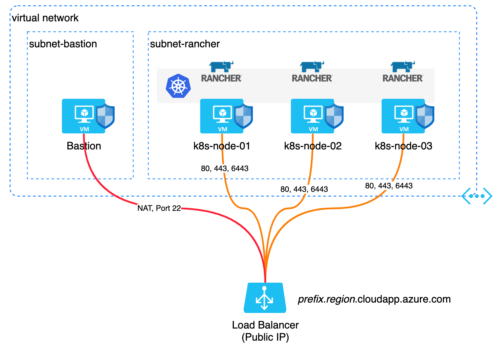

# rancher-rke-azure

This repo contains Terraform templates to deploy Rancher 2.x into a cloud environment in a HA cluster configuration. Currently, there is only a module to deploy into Azure but an additional module will be created for AWS when time permits.

### Current functionality (Azure):
- Create *n* number of Ubuntu 18.04 VMs within Azure
- Create a Ubuntu bastion host, used to deploy cluster
- Create VNet, NSGs and a load balancer to front end the cluster and Rancher
- Use the Terraform [RKE provider](https://github.com/rancher/terraform-provider-rke) to deploy the Kubenetes cluster
- Use the Terraform [Helm provider](https://www.terraform.io/docs/providers/helm/index.html) to deploy [cert-manager](https://cert-manager.io/docs/)
- Use the Terraform [Helm provider](https://www.terraform.io/docs/providers/helm/index.html) to deploy [Rancher](https://rancher.com/)


## Logical Diagram


## Requirements
- Azure CLI
- Terraform Binary

## Usage

```sh
# Download the Terraform RKE provider
./scripts/terraform-provider-rke.sh
# log into Azure
az login
az account set -s <subscription_id>
# Run Terraform to deploy the cluster
terraform init ./rancher
terraform apply ./rancher
